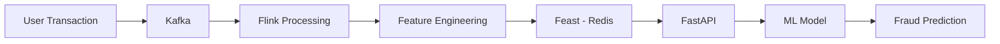
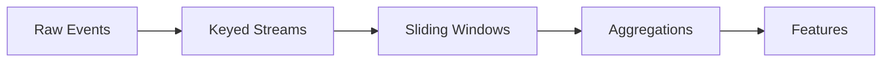
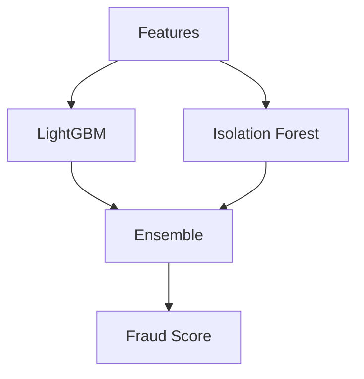
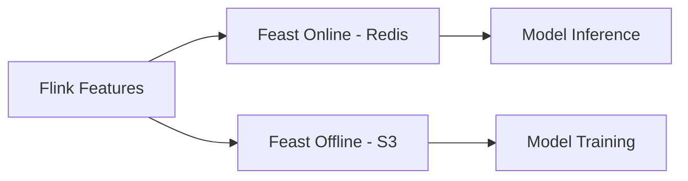
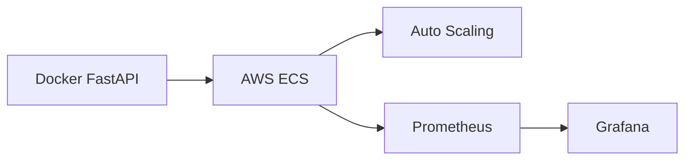

# 🛡️ FraudShield — Real-Time Hybrid E-Commerce Fraud Detection System

**[Live Dashboard]** (Add your Streamlit URL here when deployed!)
**[Live API Endpoint & Swagger Docs 🚀](https://e-commerce-real-time-hybrid-anamoly.onrender.com/docs)**
**[Live API Health Status 🟢](https://e-commerce-real-time-hybrid-anamoly.onrender.com/health)**

Python • Kafka • Flink • Feast • LightGBM • FastAPI • Docker • AWS

A production-style real-time fraud detection pipeline capable of handling 10K+ TPS with <50ms latency.

---

## 📌 Overview

This project simulates how real e-commerce companies detect fraud transactions in real time using:

- Stream processing (Kafka + Flink)
- Real-time feature engineering
- Feast feature store to avoid training-serving skew
- Hybrid ML model (LightGBM + Isolation Forest)
- FastAPI microservice deployment
- Monitoring using Prometheus & Grafana

---

## 🏗️ Architecture




---

## ⚡ Real-Time Feature Engineering (Flink)

- Velocity features (txn per min)
- Geo-location anomalies
- Device & payment behavior
- Stateful stream windows



---

## 🧠 Hybrid ML Model

- LightGBM for supervised fraud learning
- Isolation Forest for anomaly detection
- Optuna tuned ensemble
- 94% F1 Score on imbalanced data



---

## 🗃️ Feast Feature Store



- <5ms feature retrieval
- Zero training-serving skew

---

## 🚀 Deployment (AWS ECS + Docker)



---

## 📊 Performance

| Metric | Value |
|-------|-------|
| Throughput | 10K+ TPS |
| Latency | <50ms |
| F1 Score | 94% |
| False Positives | ↓ 40% |

---

## 🛠️ Run Locally

You can run the entire stack locally using Docker Compose, or manually start the services.

### Local Docker Compose
```bash
docker-compose up --build
```
This will start Redis, Prometheus, and Grafana (for monitoring).

### Manual Run (3 terminals)

**Terminal 1 — FastAPI Backend**
```bash
python api.py
# Runs on http://127.0.0.1:8001
# Docs: http://127.0.0.1:8001/docs
```

**Terminal 2 — Flink Stream Processor (optional but recommended)**
```bash
python flink_processor.py
# Streams data from CSV, computes windowed features, writes to Redis
# Uses TumblingWindow(1h) + SlidingWindow(24h) per user
```

**Terminal 3 — Streamlit Dashboard**
```bash
streamlit run app.py
# Opens at http://localhost:8501
```

## Retrain Model
```bash
python ecommerce_fraud_model.py
# Outputs: model.pkl, model_metrics.json, shap_importance.json
```

## Internal Architecture Data Flow
```
transactions.csv
     │
     ▼  flink_processor.py (TransactionSource → KeyedStream → ProcessFunction → RedisSink)
Redis (user velocity, 1h/24h windowed counts)
     │
     ▼  api.py (FastAPI) — enriches features with Flink state at prediction time
LightGBM model → fraud probability + SHAP explanation
     │
     ▼  app.py (Streamlit) — 5-tab dashboard
```

## Model Performance (on held-out FUTURE data — no leakage)
- **ROC-AUC:** 0.9736
- **Fraud Recall:** 83.7% (catches 84% of actual fraud)
- **Train cutoff:** 2024-09-01 (trained on Jan→Aug, tested on Sep→Oct)

---

## 👤 Author

Vibhuti Agarwal
