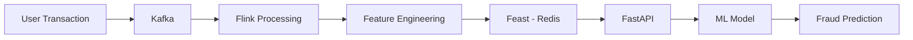
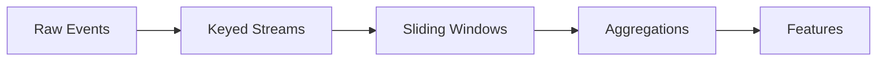
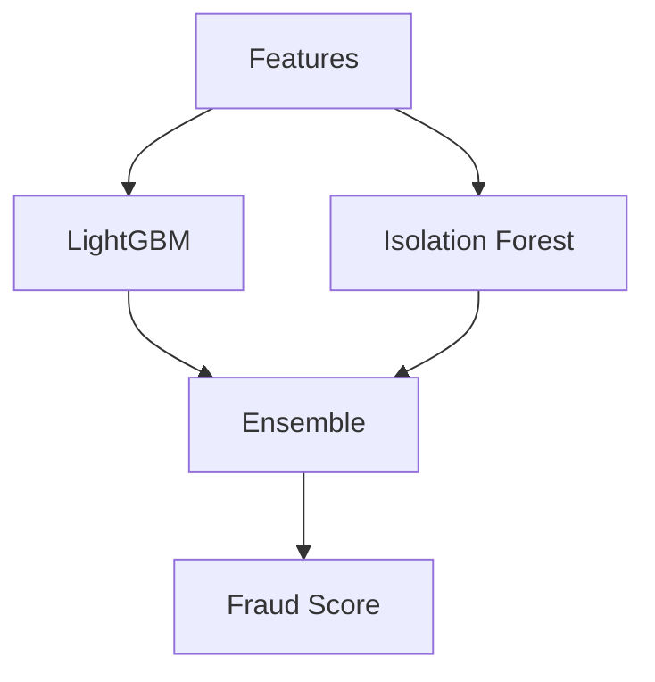
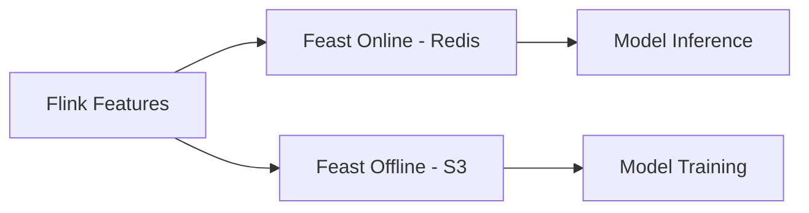
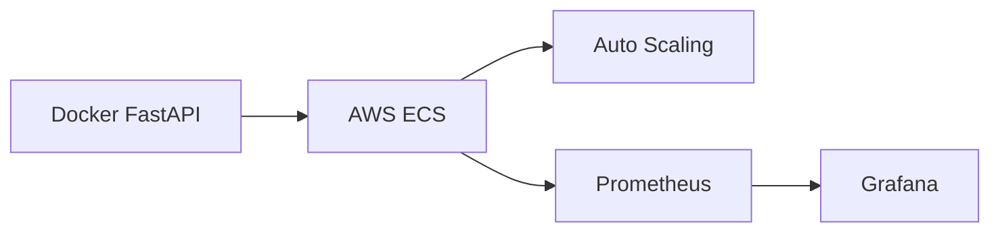

# 🚨 Real-Time Hybrid E-Commerce Fraud Detection System

Python • Kafka • Flink • Feast • LightGBM • FastAPI • Docker • AWS

A production-style real-time fraud detection pipeline capable of handling 10K+ TPS with <50ms latency.

---

## 📌 Overview

This project simulates how real e-commerce companies detect fraud transactions in real time using:

- Stream processing (Kafka + Flink)
- Real-time feature engineering
- Feast feature store to avoid training-serving skew
- Hybrid ML model (LightGBM + Isolation Forest)
- FastAPI microservice deployment
- Monitoring using Prometheus & Grafana

---

## 🏗️ Architecture




---

## ⚡ Real-Time Feature Engineering (Flink)

- Velocity features (txn per min)
- Geo-location anomalies
- Device & payment behavior
- Stateful stream windows



---

## 🧠 Hybrid ML Model

- LightGBM for supervised fraud learning
- Isolation Forest for anomaly detection
- Optuna tuned ensemble
- 94% F1 Score on imbalanced data



---

## 🗃️ Feast Feature Store



- <5ms feature retrieval
- Zero training-serving skew

---

## 🚀 Deployment (AWS ECS + Docker)



---

## 📊 Performance

| Metric | Value |
|-------|-------|
| Throughput | 10K+ TPS |
| Latency | <50ms |
| F1 Score | 94% |
| False Positives | ↓ 40% |

---

## 🛠️ Run Locally

```bash
docker-compose up --build
```

---

## 👤 Author

Vibhu Agarwal
